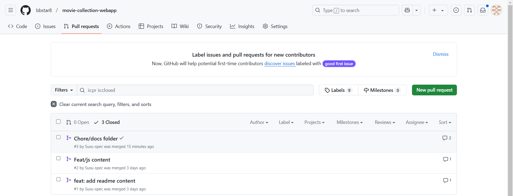

# Movie Collection Webapp
A simple web app that renders and filters movies based on their genres using HTML, CSS, and JavaScript.

## Link to Live Site and Presentation
- [Movie Collection WebApp](https://playful-cendol-7e1250.netlify.app/)    
- [Google Slides Presentation](https://docs.google.com/presentation/d/1_ifnxSk8uoNjJ6xHjGNzFQRVjCSfX-jBwL50qHsNQv0/edit?usp=sharing)

## Setup Instructions
Provide steps to get the app running locally.

### Prerequisites
- A modern web browser (e.g., Chrome, Firefox).
- A text editor or IDE(e.g., VS Code)

### Steps
1. Clone the repository
`git clone <repository-url>`

2. Navigate into the repository directory
`cd movie-collection-webapp`

3. Open `index.html` in the browser.

## Project Structure

movie-collection-webapp/  
- index.html
- css/
      - style.css  
- js/  
   - app.js  
- docs/
   - commands.md  
   - images/
- README.md  

## Links to CLI Documentation
   - [Documentation for Commands Used](docs/commands.md)
   - [Screenshots of Terminal Operations](docs/images)

## Git Workflow steps
 After initializing, committing and pushing initial project structure to GitHub

 1. Clone the repository
   ```bash
   git clone [repository-url]
   cd movie-collection
   ```
2. Create a Feature Branch
   ```bash
   git checkout -b feat/[feature-name]
   ```
3. Implement the features and commit changes
   ```bash
   git add .
   git commit -m "feat: your feature"
   ```
4. Push branch to remote
   ```bash
   git push origin feat/[feature-name]
   ```
5. Create a Pull Request on GitHub
6. Request Collaborator to review code
7. Merge the pull request


## Feature List and Implementation Details

- **Creating HTML Structure:** Created the basic layout using HTML to represent the structure of the movie collection web app.
   - Used semantic HTML tags like ```<main>```, ```<header>```, and ```<footer>``` for better accessibility and organization.
   - Included an input section with a dropdown ```<select>``` for genre filtering and a grid ```<div>``` to display the movie cards.

- **Styling using CSS:** Styled the webpage using external CSS to ensure a clean and responsive layout.
   - Applied a grid layout for displaying the movie cards to make it easy to scale on different screen sizes.
   - Added hover effects on the movie cards for a more interactive user experience.

- **Movie Data Rendering:** Movie data is stored in a ```movies.json``` file, which includes an array of movies, each containing information such as title, year, genres, posterUrl, and description.
   - When the page is loaded, a fetch request is sent to load the movie data asynchronously from the JSON file. The data is parsed and rendered.
   
- **Genre Filtering:** Filter movies based on their genres.
   -  A dropdown menu ```<select>``` allows users to filter movies based on their genre.
   - When a user selects a genre, an event listener listens for the change event on the dropdown and filters the displayed movies based on the selected genre.
 
## Team Member Contributions

### Testimony:
1. Created the Initial Project Structure
2. Created HTML structure
3. Implemented basic CSS styling
4. Contributed to README documentation

### Susu:
5. Set up movie data structure
6. Developed movie card rendering
7. Implemented movie filtering by genre feature
8. Contributed to README documentation

## Pull Request History


## Lessons Learned
1. The importance of clear communication and consistent coding styles.
2. Assigning clear responsibilities as it helps to ensure accountability and reduce duplication of work.
3. The value of using pull requests for code reviews.
4. The usefulness of peer code reviews in optimizing implementations, and ensuring adherence to best practices.
